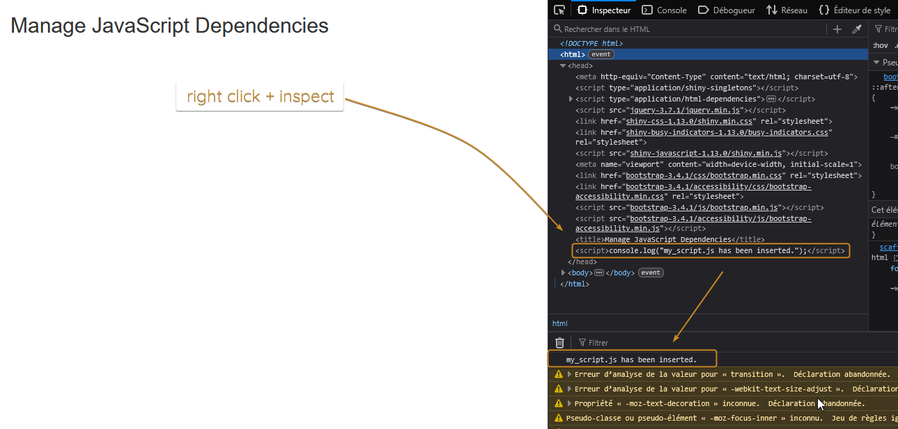
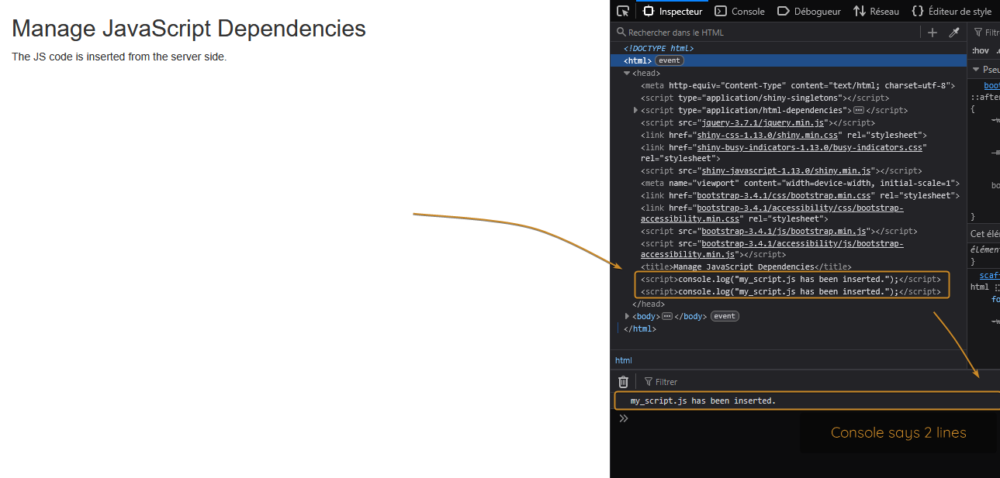
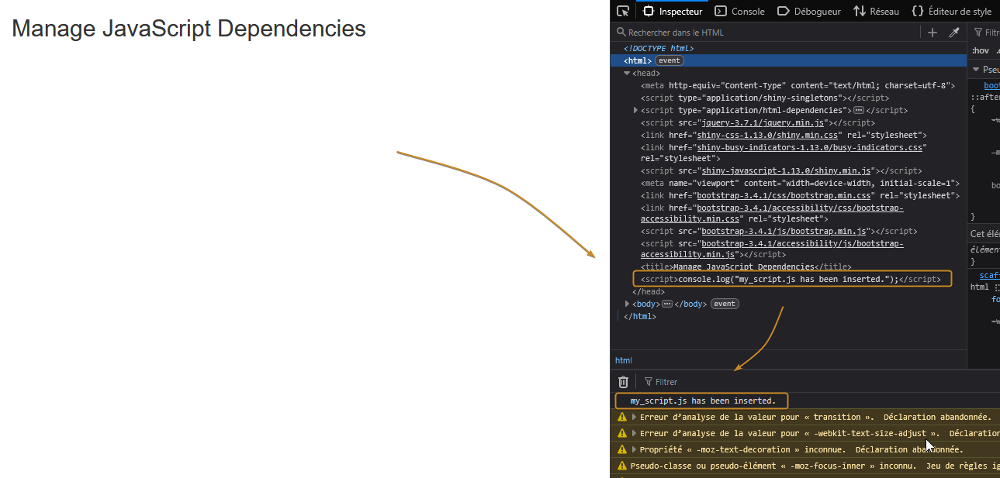

The motivations behind this article are explained in a blog post:\
link

A template is delivered for you to play with:\
[template-r-shiny-javascript-dependencies](https://github.com/thekangaroofactory/template-r-shiny-javascript-dependencies)

## Initial state

Let's start from the very well documented situation where our Shiny app has its JavaScript dependency inserted from the UI side:

```{r}
#| echo: true

library(shiny)

# -- Define UI
ui <- fluidPage(
  
  # Application title
  titlePanel("Manage JavaScript Dependencies"),
  
  # -- insert the JavaScript code
  tags$head(
    includeScript(path = "./www/js/my_script.js"))
  
)

# -- Define server logic
server <- function(input, output) {
  
  # something that uses the JS code goes here
  
}

# Run the application 
shinyApp(ui = ui, server = server)

```

The JavaScript code is already in a separate file which is a better practice compared to having it stored in a character string within the R code.\
It basically contains a single instruction to write something to the browser console:

`console.log("my_script.js has been inserted.");`

::: callout-note
For demonstration purpose, the .js file is stored under www/js/my_script.js\
Also for same reason, we will start with `includeScript()` so that you can actually see the code in the HTML page. \
We will extend later to JS code delivered along with a package.
:::

Run the app and inspect the page (right click + inspect) in the browser:



-   The Javascript code can be seen in the `head` tag of the HTML tree
-   It has been executed so the message is visible in the console

## Move it to server side

Because we want our users not to worry about the package dependencies, we will move this instruction to the server side. Because `tags$head()` actually outputs HTML code that would not go anywhere on server side, we need to send that HTML into the UI thanks to `insertUI()` function:

```{r}
# -- Define UI
ui <- fluidPage(
  
  # Application title
  titlePanel("Manage JavaScript Dependencies"),
  
)


# -- Define server logic
server <- function(input, output) {
 
  # -- insert JavaScript dependency
  insertUI(selector = "head",
           where = "beforeEnd",
           ui = includeScript(path = "./www/js/my_script.js"))
  
}
```

You will get the exact same result as before (hence not duplicating the screenshot).

## Wrap into a function

Let's wrap this code into a function – remember we try to *hide* it from the user.

```{r}
my_function <- function(){

  insertUI(selector = "head",
           where = "beforeEnd",
           ui = htmltools::includeScript(path = "./www/js/my_script.js"))
  
}
```

Server code looks like this now:

```{r}
# -- Define server logic
server <- function(input, output) {
 
  # -- insert JavaScript dependency
  my_function()
  
}
```

Now say that this function is intended to be part of your package and is called to deliver some object (maybe an HTML widget) that requires a JavaScript dependency. It's great because the user won't need to manually insert the JS code on UI side, but what if they call the function multiple times?

```{r}
# -- Define server logic
server <- function(input, output) {
 
  # -- call function that requires some JS dependency
  my_function()
  my_function()
  
}
```

Go back to the browser inspector:



This does not look good. Each time our function is called, it will insert a new instance of the JavaScript code in the HTML (here my browser collapses duplicated lines but there are 2 prints at the console).

## Remember it

Well, this behavior is just *as expected*. Since we did call two times the function that inserts the JS code, it's inserted two times in the HTML.

What we need from here is to find a way for the function to **remember** that the code has already been inserted.

An option that I won't demonstrate would be to create a specific input from the JavaScript code (using `shiny.setInputValue('name', 'value')`). This could be done at the very beginning of the JavaScript code so that checking `input$name` from the server side will return the *value*. Even just checking that `name` is an element in `input` (it behaves like a list) would be enough to know that the script was inserted on the client side.

While this work, I see two main downsides of this approach:

-   input is a reactive object, which implies you either need a reactive context or to isolate it
-   unless your package function actually needs an input, it feels a bit hacky to go this way.

## Session userData is your friend

The help page for the Shiny `session` object says the userData entry is "An environment for app authors and module/package authors to store whatever session-specific data they want".

So let's modify our function so that it checks if a specific object – here `js_inserted` – already exists in the `userData` environment. If not, it will insert the JavaScript code and create this object (setting it to a dummy value), otherwise it will just skip it.

```{r}
my_function <- function(session = getDefaultReactiveDomain()){
  
  if(is.null(session$userData$js_inserted)){
    
    print("Inserting JS dependency")
    
    insertUI(selector = "head",
             where = "beforeEnd",
             ui = htmltools::includeScript(path = "./www/js/my_script.js"))
    
    session$userData$js_inserted <- TRUE
    
  } else print("JS dependency already inserted")
  
}
```

Let's check the HTML page code in the browser:



Good! We have a single instance of the script in the HTML tree.

Also because we put some print instructions in the function, the R console shows the difference between the first and the second call to `my_function()`:

```         
Listening on http://127.0.0.1:3577
[1] "Inserting JS dependency" 
[1] "JS dependency already inserted"
```

## Wrap into a package

Okay, until now the JavaScript as well as the function files were located in the app folder structure to ease the understanding, but our goal is clearly to address packages that involve some JavaScript dependency delivered along with the package.

In this case, the my_script.js JavaScript dependency file will be in the inst directory of your package, maybe under assets/js. Which means you need to locate it first on the user installation using `system.file()` before inserting it in the UI.

```{r}
my_function <- function(session = getDefaultReactiveDomain()){
  
  if(is.null(session$userData$mypkg_js_inserted)){
    
    # -- insert JS code on client side
    insertUI(selector = "head",
             where = "beforeEnd",
             ui = htmltools::includeScript(path = file.path(system.file("assets/js", package = "mypkg"), "my_script.js")))
    
    # -- log it in memory
    session$userData$mypkg_js_inserted <- TRUE
    
  }
  
}
```

Also because you may not be alone using the session `userData` environment, I would suggest to add a prefix with the name of your package for any entry you create.

There is a remaining point that I believe we need to deal with. To make things simple (and to take screenshots), I actually inserted not the dependency but the JS code itself in the HTML. While it works just fine, it doesn't look great if you have a lot of code (plus it feels like this code is just hanging there and we don't know where it comes from).

Instead, we would love to see something like:\
`<script src="some_path/my_script.js"></script>`

Which clearly indicates we have a JavaScript dependency, but doesn't bother showing the entire code.

There are multiple ways to achieve this, but I believe the `htmlDependency` option described in the Shiny [documentation](#0){style="font-size: 11pt;"} is a great one:

```{r}
my_function <- function(session = getDefaultReactiveDomain()){
  
  if(is.null(session$userData$mypkg_js_inserted)){
    
    # -- insert JS code on client side
    insertUI(selector = "head",
             where = "beforeEnd",
             ui = htmltools::htmlDependency(name = "mypkg-assets", version = "0.1",
                                            package = "mypkg",
                                            src = "assets",
                                            script = "js/my_script.js"))
    
    # -- log it in memory
    session$userData$mypkg_js_inserted <- TRUE
    
  }
  
}
```

The resulting HTML now contains:\
`<script src="mypkg-assets-0.1/js/my_script.js"></script>`

## Conclusion

In this article, we've seen how to go from a state where a manual action is required from the user inside its UI code to enable a JavaScript package dependency that will be used later on server side to an automatically handled process.

As long as you keep track of the fact the JS code is already inserted on client side, it does not even require to do a factual check of what's in the HTML tree.\
Also using htmlDependency makes it much easier for user to understand where the JavaScript comes from as well as it's version which is great for traceability & debugging purpose.

Of course, we could transform `my_function()` into an internal `check_dependency()` function that would be called by exported functions of our package. So that shared dependencies will be managed the same way throughout the package. Or keep it with a specific JS dependency and make it return an object relying only on it.
